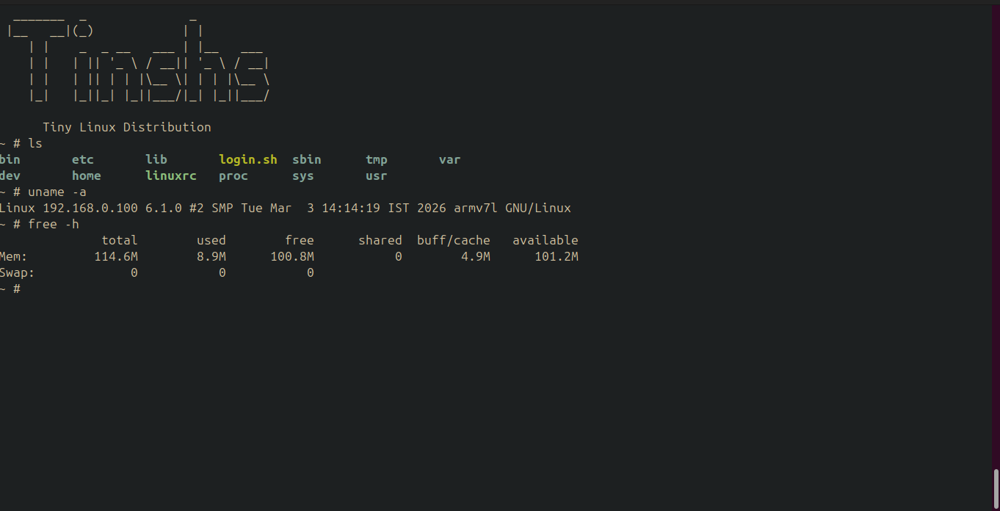

# Embedded Linux From Scratch (ARM + QEMU)

## Project Overview

This project demonstrates building an Embedded Linux system completely from scratch for an ARM target without using build systems like Buildroot or Yocto.

The system includes:

- Custom cross-toolchain (generated using crosstool-NG)
- U-Boot bootloader
- Linux Kernel (v6.1)
- Minimal BusyBox-based root filesystem
- QEMU emulation using the vexpress-a9 machine

The goal of this project is to understand the complete boot flow and internal components involved in bringing up an embedded Linux system.

---
## qemu emulation 
1. **kernel booted sucessfully**

2. **u boot prompt screen**

---
## Target Platform

- Architecture: ARM (32-bit)
- QEMU Machine: vexpress-a9
- Kernel Image: zImage
- Device Tree: vexpress-v2p-ca9.dtb

---

## Boot Flow

ROM → U-Boot → Linux Kernel (zImage) → Device Tree → Root Filesystem → init → Shell

This project walks through each stage individually.

---

## Repository Structure
- toolchain/ → Cross-toolchain generation and configuration
- uboot/ → U-Boot build and configuration
- kernel/ → Linux kernel build and configuration
- busybox-rootfs/ → Root filesystem creation
- qemu/ → QEMU run configuration (to be added)

---

## How To Use This Repository

Follow the components in order:

1. Build the cross-toolchain from the `toolchain/` directory.
2. Build U-Boot from the `uboot/` directory.
3. Build the Linux kernel from the `kernel/` directory.
4. Create the root filesystem from `busybox-rootfs/`.
5. Finally, use the QEMU emulation setup inside the `qemu/` directory to boot the complete system.

Each folder contains documentation and scripts required to reproduce the build.

---

## What This Project Covers

- Cross-compilation for ARM
- Bootloader configuration and build
- Kernel configuration and compilation
- Device tree usage
- Root filesystem creation
- Booting via QEMU
- Debugging early boot issues

---

## Learning Objectives

- Understand the role of each component in embedded Linux
- Learn how kernel configuration affects runtime behavior
- Understand how U-Boot loads and boots the kernel
- Gain hands-on experience with low-level Linux bring-up

---

## Status

QEMU emulation scripts and final boot integration will be added under the `qemu/` directory.

---

This project is intended for learning and demonstration of embedded Linux fundamentals.
